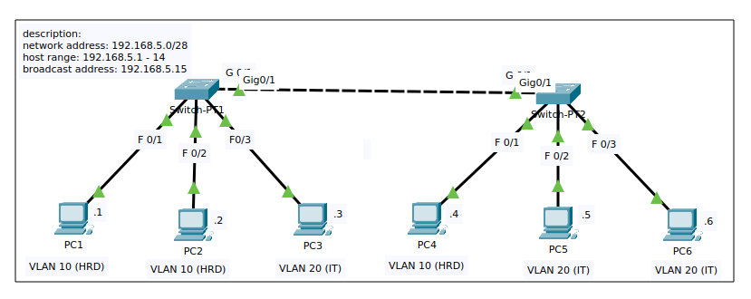

# 📘 Praktikum 1 – Membangun dan Mengonfigurasi Jaringan VLAN Dasar Menggunakan Dua *Switch*

## 🎯 Tujuan

- Membangun dan menetapkan VLAN pada *switch*.
- Memahami perbedaan antara *access port* dan *trunk port*.
- Mengonfigurasi *switch* untuk mengimplementasikan VLAN.
- Menguji isolasi koneksi antar VLAN menggunakan dua *switch*.
- Mengenalkan konsep segmentasi jaringan berbasis VLAN.

---

## 🗺️ Skenario

Praktikum ini bertujuan membangun jaringan menggunakan dua *switch* layer 2 dan enam PC klien dari dua kelompok VLAN berbeda. Kedua *switch* terhubung menggunakan port trunk, sementara setiap PC ditempatkan ke dalam VLAN yang sesuai.

### 💻 Perangkat:

- 2x *Switch L2*: `Switch-PT1`, `Switch-PT2`
- 6x PC: `PC1` – `PC6`
- Koneksi antar *switch* melalui port trunk

### 🔗 Koneksi:

| Perangkat | Koneksi ke Switch | VLAN        |
|-----------|-------------------|-------------|
| PC1       | Switch-PT1 Fa0/1  | 10 (HRD)    |
| PC2       | Switch-PT1 Fa0/2  | 10 (HRD)    |
| PC3       | Switch-PT1 Fa0/3  | 20 (IT)     |
| PC4       | Switch-PT2 Fa0/1  | 10 (HRD)    |
| PC5       | Switch-PT2 Fa0/2  | 20 (IT)     |
| PC6       | Switch-PT2 Fa0/3  | 20 (IT)     |
| Trunk     | Switch-PT1 Gi0/1 ↔ Switch-PT2 Gi0/1 | Semua VLAN |


---

## ⚙️ Konfigurasi

### 1. Ubah nama *switch* (hostname)

```bash
Switch> enable
Switch# configure terminal
Switch(config)# hostname Switch-PT1
````

### 2. Buat VLAN pada masing-masing *switch*

```bash
Switch-PT1(config)# vlan 10
Switch-PT1(config-vlan)# name HRD
Switch-PT1(config-vlan)# exit

Switch-PT1(config)# vlan 20
Switch-PT1(config-vlan)# name IT
Switch-PT1(config)# end
```

### 3. Tetapkan port ke VLAN (*access port*)

```bash
Switch-PT1(config)# interface range fa0/1 - 2
Switch-PT1(config-if-range)# switchport mode access
Switch-PT1(config-if-range)# switchport access vlan 10
Switch-PT1(config-if-range)# exit

Switch-PT1(config)# interface fa0/3
Switch-PT1(config-if)# switchport mode access
Switch-PT1(config-if)# switchport access vlan 20
Switch-PT1(config-if)# end
```

### 4. Konfigurasikan *trunk port*

```bash
Switch-PT1(config)# interface gi0/1
Switch-PT1(config-if)# switchport mode trunk
```

> 💡 Ulangi semua langkah di atas pada `Switch-PT2` dengan penyesuaian port yang sesuai.

---

## 🔍 Pengujian & Hasil

| Pengujian                                   | Hasil         |
|---------------------------------------------|---------------|
| `ping` PC1 → PC2 (HRD pada switch yang sama) | ✅ Berhasil   |
| `ping` PC1 → PC4 (HRD pada switch berbeda)   | ✅ Berhasil   |
| `ping` PC3 → PC5/PC6 (IT pada switch berbeda)| ✅ Berhasil   |
| `ping` PC1 → PC3 (HRD ke IT)                 | ❌ Tidak berhasil |
| `ping` PC2 → PC5/PC6 (HRD ke IT)             | ❌ Tidak berhasil |
| `show vlan brief`                            | ✅ Setiap port telah berada dalam VLAN yang tepat |
| `show interfaces switchport`                 | ✅ Port yang terhubung ke host berada dalam mode *access* |
| `show interfaces trunk`                      | ✅ Antarmuka `Gi0/1` berhasil dikonfigurasi sebagai *trunk port* |

> 📌 Host yang berada dalam VLAN yang sama dapat saling terhubung, meskipun melewati switch yang berbeda.  
> 📌 Komunikasi antar host yang berada di VLAN berbeda dibatasi secara default karena belum dikonfigurasi *inter-VLAN routing*.

***

## 🧠 Troubleshooting

| Masalah Ditemukan | Solusi |
| ----------------- | ------ |
| —                 | —      |

---

## 📁 Sumber Daya

Beberapa sumber daya pendukung dari hasil praktikum telah disiapkan untuk dilampirkan di bawah ini.

### 🖼️ Screenshots Topologi



### 📦 File Hasil Pratikum (.pkt)

[File PKT Praktikum 1](../resources/packet-tracer-files/praktikum-1-membangun-dan-mengonfigurasi-jaringan-vlan-dasar-menggunakan-dua-switch.pkt)

***

## 📎 Referensi

* [Cisco Networking Academy](https://www.netacad.com/)
* [GitHub: lilulil-akbar – Dokumentasi CCNA SRWE](https://github.com/lilulil-akbar/ccna-switching-routing-wireless-docs)

---


> 📌 Ditulis oleh: **Ulil Akbar**
> 📅 Tanggal: 2025-06-27
